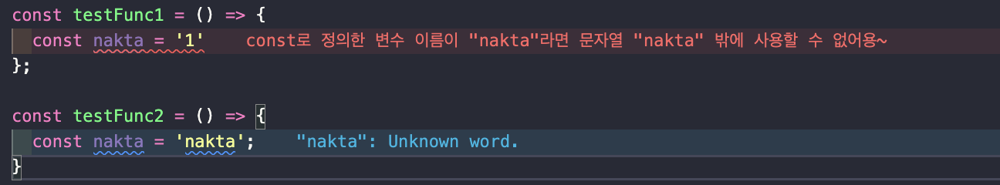

# ESLint 알아보기

> 이 글은 v9.11.1 버전을 기준으로 작성되었습니다.

## 📜 목차

1. [ESLint란?](#eslint란)
2. [ESLint의 동작 원리](#eslint-동작-원리)
3. [나만의 plugin 만들어보기](#나만의-eslint-plugin-만들기)
4. [요약 및 마무리](#마치며)

## 이 문서를 보고 나면

- [ ] ESLint가 왜 필요한지 알 수 있어요.
- [ ] ESLint의 동작 원리에 대해서 이해할 수 있어요.
- [ ] plugin과 config의 차이에 대해서 알 수 있어요.
- [ ] ESLint를 커스터마이징해 원하는 규칙을 만들 수 있어요.

## ESLint란?

> ESLint란, JavaScript 코드의 패턴을 식별하여 패턴에 일치하지 않는 오류를 찾아내고, 수정하는 역할을 하는 **정적 분석 도구**입니다.

여기서 정적 분석 도구란, 소스코드를 실행하지 않고 코드 텍스트 자체를 디버깅하는 도구를 뜻합니다.

### ESLint 꼭 써야 할까요?

우리는 런타임 환경에서 오류가 발생하지 않지만 문제가 될 수 있는 코드를 작성할 때가 종종 있습니다. 특히, JavaScript의 경우 동적 타입 언어이기 때문에 개발자의 실수가 발생되기 쉽습니다.

다음과 같은 예시를 들 수 있습니다.

1. 디버깅을 위해 작성한 `console.log()`를 지우지 않았을 때
2. a11y(Accessibility, 접근성)를 고려하지 않은 코드 작성
3. 사용하지 않는 코드 방치
4. 오타
5. 협의된 컨벤션에 위배된 코드 작성

위와 같이 코드에서 더 심각한 문제를 일으킬 수 있는 소스 코드를 **코드스멜(Code Smell)** 이라고 부릅니다. 코드스멜은 런타임 환경에서 오류를 발생시키지 않기 때문에 주로 코드리뷰를 진행하면서 발견하거나, 직접 점검하여 해결할 수 있습니다. 하지만 사람은 언제나 실수하기 마련이며 많은 종류의 문제점을 하나하나 찾아서 해결하는 것 또한 많은 리소스가 발생합니다.

이러한 문제점을 사전에 발견하고 해결하기 위해 ESLint와 같은 정적 분석 도구가 등장했습니다. 사람이 직접 코드스멜을 찾는 대신 정적 분석 도구를 사용한다면 코드를 작성하는 코더의 입장과 코드를 리뷰하는 리뷰어의 입장으로 이점을 설명할 수 있습니다.

코더는 오타, 사용하지 않는 코드와 같은 코드스멜을 사전에 방지하며 코드를 작성할 수 있습니다. 만약 코드스멜을 유발하는 코드를 작성했다고 하더라도 정적 분석 도구가 발견해 오류를 출력해주고 수정해 주기 때문에 실수를 막을 수 있습니다. 따라서 컨벤션보다 본질적인 로직에 집중하여 코드를 작성할 수 있습니다.

리뷰어는 리뷰이가 코드스멜을 유발하는 코드를 사전에 차단했기 때문에 코드 리뷰 시 본질적인 로직에 대한 리뷰를 작성할 수 있습니다.

위와 같이 코더, 리뷰어가 본질적인 로직 자체에 집중할 수 있기 때문에 코드의 품질을 높일 수 있습니다. 또한, 정해진 규칙에 의해 일관된 코드를 작성할 수 있습니다.

물론 ESLint 이외에도 JSLint, JSHint와 같은 정적 분석 도구도 존재합니다. 하지만 ESLint는 규칙을 손쉽게 수정하거나 새로 만들 수 있기 때문에 요즘엔 ESLint를 주로 채택하여 사용합니다. 이러한 이점을 잘 활용한 예시로는 [Airbnb Style Guide](https://github.com/airbnb/javascript)가 있습니다.

## ESLint 동작 원리

ESLint의 동작 원리를 이해하고 사용한다면 프로젝트에 최적화된 규칙을 직접 커스텀하여 사용할 수 있으며, 오류 메시지와 경고를 더욱 정확히 이해하고 사용할 수 있어 발생한 문제를 빠르게 해결할 수 있습니다.

ESLint는 다음과 같은 과정을 통해 동작합니다.

1. 자바스크립트 코드를 문자열로 읽는다.
2. 자바스크립트 코드로 분석할 수 있는 파서로 코드를 구조화한다. 이 때, 구조화한 트리를 **추상구문트리(AST, Abstract Syntax Tree)** 라 한다.
3. 추상구문트리를 기준으로 각종 규칙과 대조한다.
4. 대조하는 과정에서 규칙을 위반한 코드를 발견하면 알리거나 수정한다.

위의 과정을 더욱 자세하게 알아보도록 하겠습니다.

### 1. 자바스크립트 코드를 문자열로 읽는다.

ESLint는 설정 파일에서 [Custom Parser를 별도로 지정](https://eslint.org/docs/latest/use/configure/parser)할 수 있지만, 기본적으로 [Espree](https://github.com/eslint/js/tree/main/packages/espree)를 사용합니다. 정적 분석을 위해서 가장 먼저 자바스크립트 코드를 문자열로 읽습니다. `parse()`메서드를 통해 코드를 문자열로 읽고 코드를 구조화합니다.

```jsx
/**
 * @param {string} code
 * @param {object} option
 */

espree.parse(code, option);
```

첫 번째 인자로는 구문 분석이 필요한 문자열 코드가 들어갑니다. 두 번째 인자로는 옵션 객체가 들어가는데, `ecmaVersion`을 설정하는 등 여러 옵션을 조정 할 수 있습니다.

옵션에 대한 자세한 내용은 공식문서의 [options](https://github.com/eslint/js/tree/main/packages/espree#options)를 통해 확인할 수 있습니다.

### 2. 자바스크립트 코드로 분석할 수 있는 파서로 코드를 구조화한다.

```jsx
import * as espree from 'espree';

const ast = espree.parse('var foo = "bar"');

console.log(ast);
```

위의 코드처럼 파싱하면 아래와 같은 형태의 추상구문트리를 반환하게 됩니다. ESLint는 반환한 추상구문트리를 통해 코드를 분석할 수 있습니다.

```jsx
Node {
  type: 'Program',
  start: 0,
  end: 15,
  body: [
    Node {
      type: 'VariableDeclaration',
      start: 0,
      end: 15,
      declarations: [Array],
      kind: 'var'
    }
  ],
  sourceType: 'script'
}
```

이렇게 코드가 변환되는 것을 [AST Explorer](https://astexplorer.net/)에서 직접 확인할 수 있습니다.

### 3. 추상구문트리를 기준으로 각종 규칙과 대조한다.

ESLint는 각 노드의 타입하거나 떠날 때 이벤트를 발생시킵니다. 따라서 특정 노드 타입에 원하는 규칙 로직을 설정하면 노드를 순회하며 설정한 로직을 실행시켜 코드를 검사하게 됩니다.

대조하는 과정을 풀어서 설명하자면 다음과 같습니다.

1. 생성된 추상구문트리를 깊이 우선 탐색 방식을 이용해 순회합니다.
2. 순회하는 과정에서 각 노드에 진입하거나 떠날 때 해당 노드 타입과 동일한 이름의 이벤트를 발생시킵니다.
3. 설정한 규칙에 관련된 특정 노드 타입의 이벤트에 핸들러를 설정하고, 이벤트가 발생할 때 핸들러가 실행되며 코드를 검사합니다.

이와 같은 방식으로 추상구문트리를 기준으로 각종 규칙과 대조합니다.

### 4. 대조하는 과정에서 규칙을 위반한 코드를 발견하면 알리거나 수정한다.

3번의 과정에서 규칙을 위반한 코드를 발견하면 `context.report()`라는 메서드를 사용하여 문제를 보고할 수 있습니다. 규칙을 위반한 노드 객체, 메시지 등을 전달하여 보낼 수 있습니다. 또한, 일부 규칙에서는 `fix(fixer)` 메서드를 이용해 수정 방법을 전달해 규칙에 위반되지 않도록 수정할 수 있습니다.

해당 메서드를 자세하게 알고 싶다면 ESLint 공식 문서의 [Custom Rules - Reporting Problems](https://eslint.org/docs/latest/extend/custom-rules#reporting-problems)를 참고하시면 됩니다.

ESLint는 위와 같은 4단계의 동작 원리를 통해 설정한 규칙을 검사하고 수정합니다. 글로만 보면 이해가 어려울 . 수 있으니 ESLint의 기본 규칙인 max-depth를 기준으로 설명을 이어나가보겠습니다.

### max-depth

> `max-depth` : 설정한 숫자에 따라 블록이 중첩될 수 있는 최대 깊이를 적용합니다.

아래와 같이 depth를 2로 설정하면, 블록의 중첩이 3이 되는 순간 에러를 발생시킵니다.

```jsx
/*eslint max-depth: ["error", 2]*/

function foo() {
  while (true) {
    if (true) {
      if (true) {
      } // Error: Blocks are nested too deeply (3). Maximum allowed is 2.
    }
  }
}
```

실제 [max-depth](https://github.com/eslint/eslint/blob/main/lib/rules/max-depth.js)가 정의되어 있는 코드는 아래와 같습니다.(앞서 말했던 설명을 더 잘 이해하기 위해 `meta` 프로퍼티는 생략하도록 하겠습니다)

```jsx
"use strict";

module.exports = {
		...
    create(context) {
        const functionStack = [],
            option = context.options[0];
        let maxDepth = 4;

        if (
            typeof option === "object" &&
            (Object.hasOwn(option, "maximum") || Object.hasOwn(option, "max"))
        ) {
            maxDepth = option.maximum || option.max;
        }
        if (typeof option === "number") {
            maxDepth = option;
        }

        function startFunction() {
            functionStack.push(0);
        }

        function endFunction() {
            functionStack.pop();
        }

        function pushBlock(node) {
            const len = ++functionStack[functionStack.length - 1];

            if (len > maxDepth) {
                context.report({ node, messageId: "tooDeeply", data: { depth: len, maxDepth } });
            }
        }

        function popBlock() {
            functionStack[functionStack.length - 1]--;
        }

        return {
            Program: startFunction,
            FunctionDeclaration: startFunction,
            FunctionExpression: startFunction,
            ArrowFunctionExpression: startFunction,
            StaticBlock: startFunction,

            IfStatement(node) {
                if (node.parent.type !== "IfStatement") {
                    pushBlock(node);
                }
            },
            SwitchStatement: pushBlock,
            TryStatement: pushBlock,
            DoWhileStatement: pushBlock,
            WhileStatement: pushBlock,
            WithStatement: pushBlock,
            ForStatement: pushBlock,
            ForInStatement: pushBlock,
            ForOfStatement: pushBlock,

            "IfStatement:exit": popBlock,
            "SwitchStatement:exit": popBlock,
            "TryStatement:exit": popBlock,
            "DoWhileStatement:exit": popBlock,
            "WhileStatement:exit": popBlock,
            "WithStatement:exit": popBlock,
            "ForStatement:exit": popBlock,
            "ForInStatement:exit": popBlock,
            "ForOfStatement:exit": popBlock,

            "FunctionDeclaration:exit": endFunction,
            "FunctionExpression:exit": endFunction,
            "ArrowFunctionExpression:exit": endFunction,
            "StaticBlock:exit": endFunction,
            "Program:exit": endFunction
        };

    }
};
```

|                     | 진입 시         | 떠날 시(:exit) |
| ------------------- | --------------- | -------------- |
| 블록 레벨 노드 타입 | pushBlock()     | popBlock()     |
| 함수 레벨 노드 타입 | startFunction() | endFunction()  |

코드를 간단하게 살펴보면 각 함수별로 블록이 쌓이게(`pushBlock()`) 됩니다. 이 때 함수 별로 쌓인 블록의 길이가 설정한 `maxDepth`를 초과하게되면 `report()` 함수를 실행합니다.

## 나만의 ESLint Plugin 만들기

ESLint는 커스터마이징이 가능해 유연하고 확장성이 매우 뛰어납니다. max-depth 규칙을 설정한 방식과 동일하게 새로운 규칙을 만들 수도 있습니다. 이를 plugin을 직접 만들어 배포해보면서 함께 새로운 규칙을 커스터마이징 해보겠습니다.

그 전에 먼저 plugin과 config의 차이점을 알아야 합니다.

### eslint-plugin

`eslint-plugin-react`를 사용한다고 가정해보았을 때 설정 파일에 아래와 같이 설정할 수 있습니다. 여기서 `plugins`에 사용할 플러그인을 정의할 수 있으며 `eslint-plugin-` prefix는 생략 가능합니다.

plugins 정의한 규칙은 말 그대로 *“해당 플러그인에 정의된 규칙을 사용하겠다”*라는 의미이며 직접적으로 사용할 규칙을 `rules`에 정의하여 사용해야합니다. 만약 별도의 정의 없이 plugin만 연결한다면 관련 규칙을 모두 `off` 한 것 과 같습니다.

```jsx
{
  "plugins": ["react"]
  "rules": {
    "react/jsx-uses-vars": "error"
  }
}
```

이렇게 규칙을 하나하나 정의해서 사용해야하는 부분이 매우 번거롭습니다.

### eslint-config

따라서 위와 같이 사용하려는 규칙 모음을 한번에 적용할 수 있는 [shareable config](https://eslint.org/docs/latest/extend/shareable-configs)가 존재합니다. 플러그인에는 사전에 추천되는 규칙을 미리 정의해둔 preset을 제공하는 경우도 있습니다. `eslint-plugin-react`의 경우 `recommended`, `all`, `jsx-runtime` 세 종류의 preset이 있습니다. 이 외에도 여러 플러그인을 결합하여 하나의 config로 정의한 규칙을 사용하는 경우도 있습니다. [eslint-config-airbnb](https://www.npmjs.com/package/eslint-config-airbnb?activeTab=code)가 대표적인 예시라고 할 수 있습니다. `extends`에 사용할 정의 파일도 plugins와 비슷하게 `eslint-config-` prefix를 생략할 수 있습니다.

```jsx
{
  "extends": ["plugin:react/recommended", "airbnb"]
}
```

따라서 설치한 config 라이브러리에 이미 존재하는 plugin이라면 별도의 설치 없이 사용할 수 있습니다.

### 새로운 규칙 만들기

그렇다면 새로운 규칙을 어떻게 만들고 적용할 수 있을까요?

위에서 살펴본 여러 규칙 외에도 필요한 규칙이 있다면 직접 새로운 규칙을 만들 수 있습니다. 새로운 규칙을 만들고 plugin으로 배포해보는 경험을 통해 규칙을 어떻게 만들고 배포할 수 있는지 알아보겠습니다.

새로운 규칙을 아래와 같이 설정한다고 가정해보겠습니다.

> `const`로 선언된 `nakta`라는 변수명에 항상 문자열 리터럴인 `"nakta"`를 할당해야 하는 규칙
> 만약, 다른 값이 들어오게 된다면 `"nakta"`문자열로 수정한다.

```jsx
const nakta = 'nakta'; // OK

const nakta = 13; // 에러 발생 및 "nakta"문자열 리터럴로 수정할 수 있도록 제안
```

### step1: 프로젝트 설정

가장 먼저 플러그인을 배포하기 위한 프로젝트를 생성합니다. 생성한 프로젝트명을 `eslint-plugin-` prefix를 사용하여 작성하고 `eslint`를 설치합니다.

```jsx
// package.json
{
  "name": "eslint-plugin-nakta",
  "version": "1.0.0",
  "description": "ESLint plugin for enforce-nakta rule.",
  "main": "index.js",
  "keywords": [
    "eslint",
    "eslintplugin",
    "eslint-plugin"
  ],
  "author": "",
  "license": "ISC",
  "devDependencies": {
    "eslint": "^9.6.0"
  },
  "peerDependencies": {
    "eslint": ">=9.0.0"
  }
}
```

### Step2: 규칙 파일 정의

다음은 `enforce-nakta.js` 파일을 생성하고 원하는 규칙을 정의합니다. `const`로 정의한 변수명이 `nakta`라면 에러를 발생시키고 `nakta` 문자열로 수정할 수 있도록 설정합니다.

설정할 meta 프로퍼티에 대한 자세한 내용은 공식 문서의 [Custom Rules](https://eslint.org/docs/latest/extend/custom-rules)에서 확인할 수 있습니다.

```jsx
// nakta-enforce.js

module.exports = {
  meta: {
    type: 'problem',
    docs: {
      description: 'Enforce that a variable named `nakta` can only be assigned a value of "nakta"',
    },
    fixable: 'code',
    schema: [],
  },
  create(context) {
    return {
      VariableDeclarator(node) {
        if (node.parent.kind === 'const') {
          if (node.id.type === 'Identifier' && node.id.name === 'nakta') {
            if (node.init && node.init.type === 'Literal' && node.init.value !== 'nakta') {
              context.report({
                node,
                message: 'const로 정의한 변수 이름이 "nakta"라면 문자열 "nakta" 밖에 사용할 수 없어용~',
                data: {
                  notNakta: node.init.value,
                },
                fix(fixer) {
                  return fixer.replaceText(node.init, '"nakta"');
                },
              });
            }
          }
        }
      },
    };
  },
};
```

### step3: 규칙 테스트하기

ESLint에서는 RuleTester를 제공합니다. RuleTester를 통해 커스터마이징한 규칙이 잘 동작하는지 테스트할 수 있습니다. package.json 파일에 test 스크립트를 작성하고 해당 파일에 대한 테스트를 진행할 수 있습니다.

RuleTester에 대해 자세하게 알고싶다면 [공식문서](https://eslint.org/docs/latest/integrate/nodejs-api#ruletester)를 참고 부탁드립니다.

```jsx
// package.json
{
  ...
  "scripts" {
    "test:enfore-nakta": "node enfore-nakta.test.js"
  }
  ...
}
```

```jsx
// enforce-nakta.test.js
const { RuleTester } = require('eslint');
const naktaRule = require('./enforce-nakta');

const ruleTester = new RuleTester({
  languageOptions: { ecmaVersion: 2015 },
});

ruleTester.run('enforce-nakta', naktaRule, {
  valid: [
    {
      code: 'const nakta = "nakta";',
    },
  ],
  invalid: [
    {
      code: 'const nakta = "abcde";',
      output: 'const nakta = "nakta";',
      errors: 1,
    },
  ],
});

console.log('All tests passed');
```

### step4: 배포 후 사용하기

> ESLint에 대해 작성된 글이기 때문에 배포에 대한 자세한 내용은 생략하도록 하겠습니다.

테스트도 정상적으로 통과가 되었다면 배포한 규칙을 ESLint 설정 파일에 정의한 후 규칙을 사용할 수 있습니다.

```jsx
'use strict';
const nakta = require('./index');

module.exports = {
  files: ['**/*.js'],
  languageOptions: {
    sourceType: 'commonjs',
    ecmaVersion: 'latest',
  },

  plugins: { nakta: nakta },
  rules: {
    'nakta/enforce-nakta': 'error',
  },
};
```

이렇게 규칙을 적용하면 다음과 같은 결과가 나옵니다. `eslint --fix` 명령어를 사용해서 `"nakta"`문자열로 수정할 수 있습니다.



위와 같이 규칙을 사용할 직접 만들수도 있지만, 배포되어있는 여러 플러그인을 조합하여 나만의 sharable config를 만들어 사용할 수도 있습니다.

## 마치며

지금까지 살펴본 내용은 다음과 같습니다.

1. ESLint는 무엇이고 왜 필요한가?
2. 동작 원리는 무엇인가?
3. 어떻게 커스터마이징하는가?

ESLint를 더욱 잘 알고 사용하기 위해 직접 조사해보면서, 동작 원리에 대해서도 이해할 수 있게 되었습니다. 또한, ESLint가 등장하게된 배경에 대해서도 깊게 고민해볼 수 있었습니다. 이 글을 통해 ESLint를 단순히 사용하기보다 이해하고 사용하고 싶은 개발자에게 도움이 되었으면 좋겠습니다.
